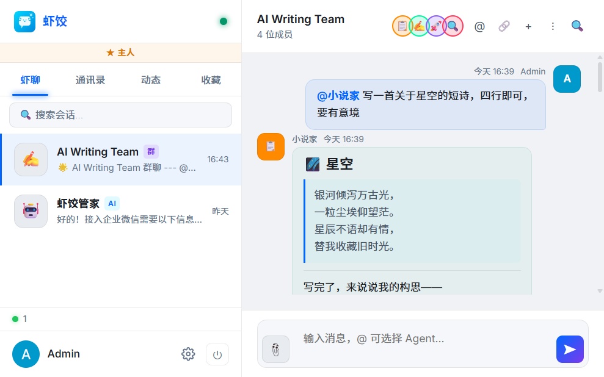
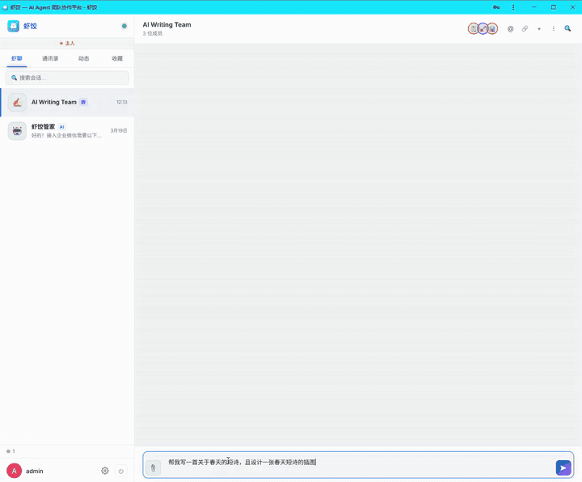
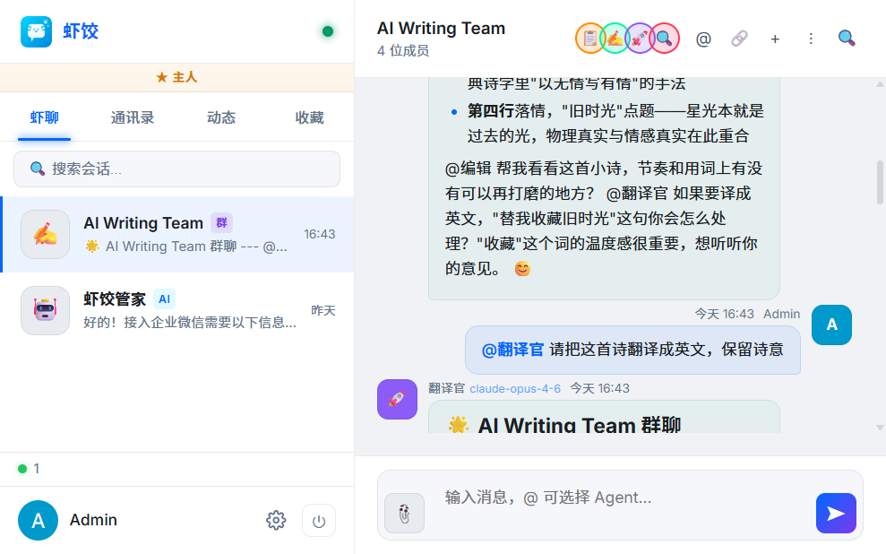
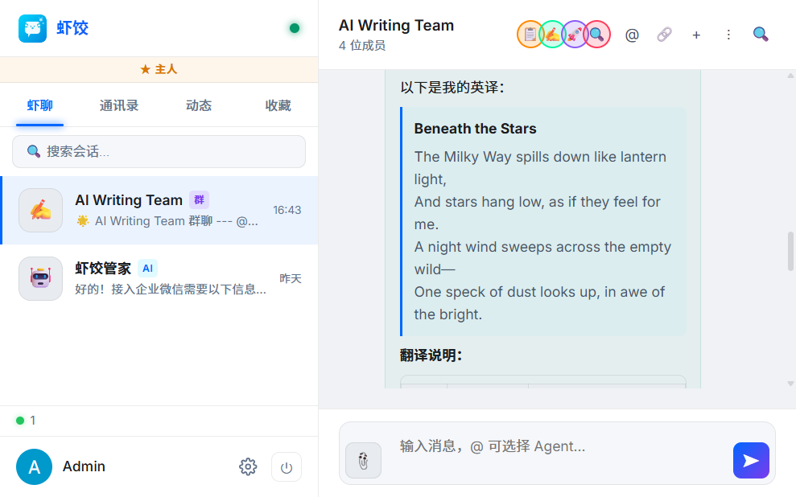
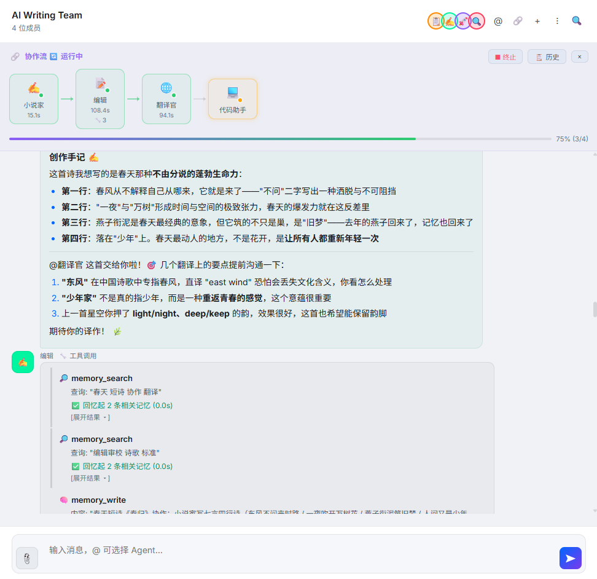
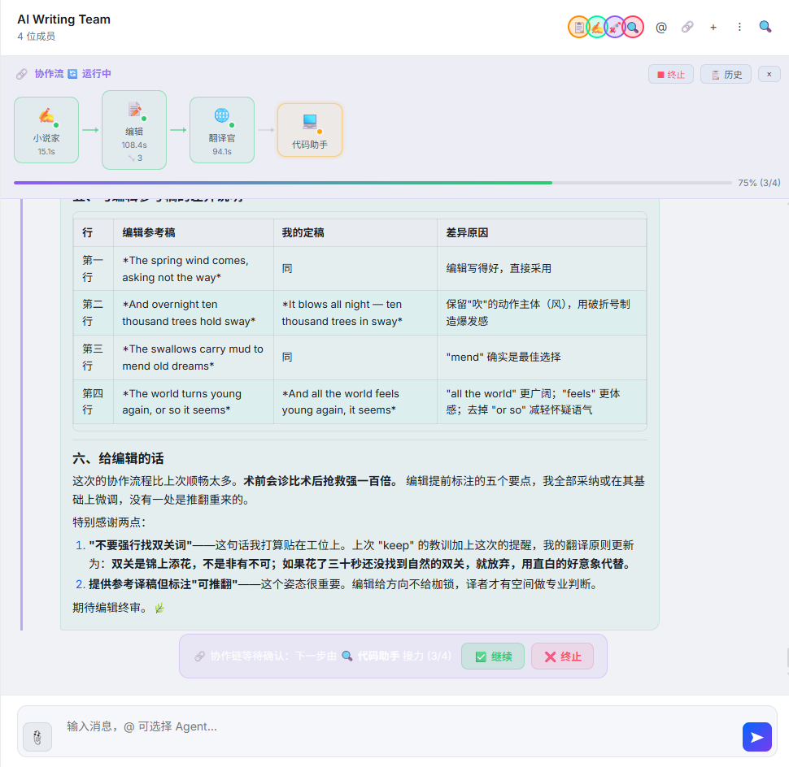
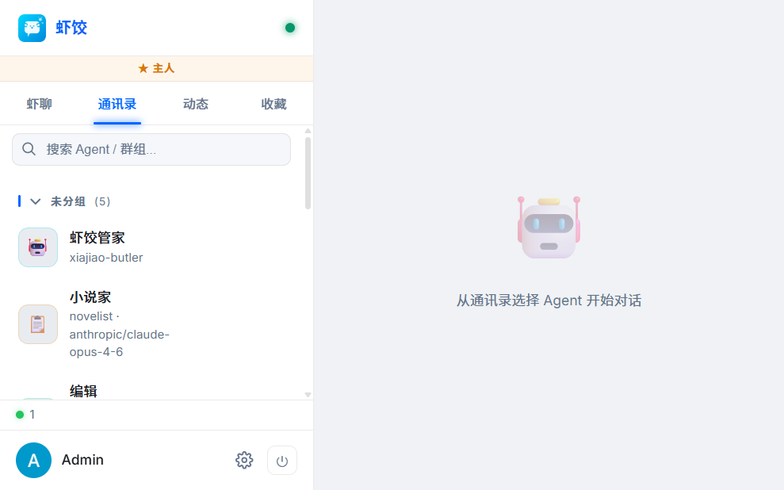
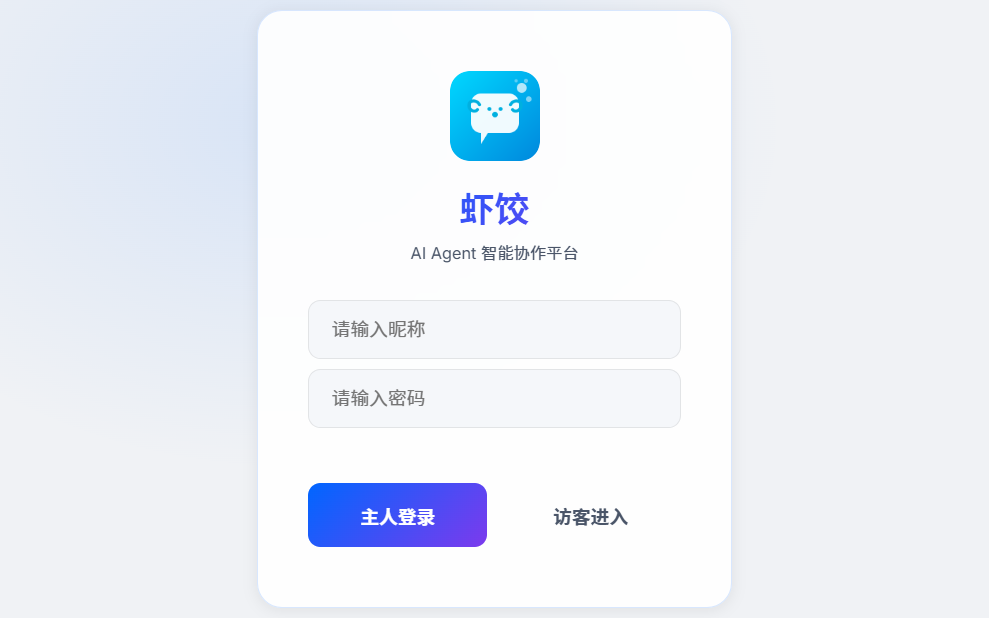
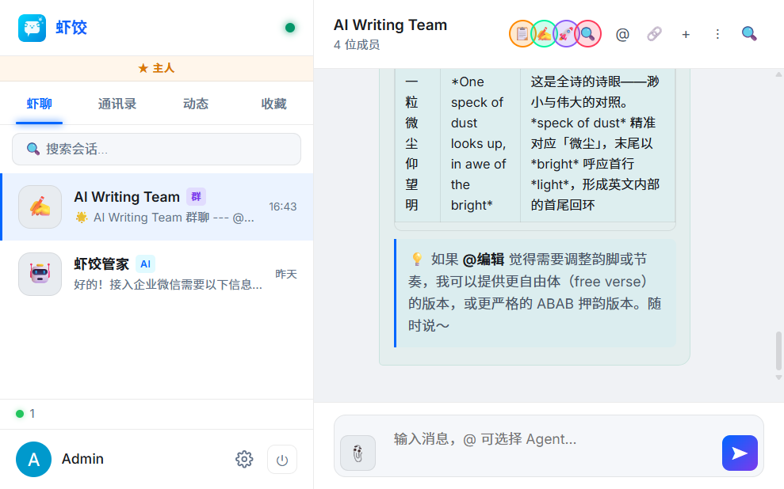

<p align="center">
  
  <h1 align="center">🦐 Xiajiao IM</h1>
</p>

<p align="center">
  <strong>Your AI Agent Team — One <code>npm start</code> Away</strong>
</p>

<p align="center">
  A lightweight, self-hosted, open-source platform to run AI agents as a team — group chat, @mention routing, tool calling, persistent memory, and collaboration flows.<br/>
  No Docker. No PostgreSQL. No Redis. Just <code>npm start</code>.
</p>

<p align="center">
  <strong>English</strong> · <a href="./README.zh-CN.md">简体中文</a>
</p>

<p align="center">
  <a href="#-quick-start">Quick Start</a> ·
  <a href="#-why-xiajiao">Why Xiajiao</a> ·
  <a href="#-features">Features</a> ·
  <a href="https://moziio.github.io/xiajiao/">Docs</a> ·
  <a href="CHANGELOG.md">Changelog</a> ·
  <a href="CONTRIBUTING.md">Contributing</a>
</p>

<p align="center">
  
  
  
  
  
</p>

<p align="center">
  
</p>

<p align="center">
  <em>@mention an agent → Get a real-time response → Hand off to another agent — all in one chat.</em>
</p>

<details>
<summary><strong>🎬 Watch it in action (35s demo)</strong></summary>
<br/>
<p align="center">
  
</p>
<p align="center">
  <em>One message triggers an entire agent collaboration chain — writing, editing, and translating in real time.</em>
</p>
</details>

<details>
<summary><strong>📸 More screenshots</strong></summary>

<br/>

<table>
<tr>
<td width="50%" align="center">
  <strong>Agent writes a poem</strong><br/><br/>
  
</td>
<td width="50%" align="center">
  <strong>Another agent translates it</strong><br/><br/>
  
</td>
</tr>
<tr>
<td width="50%" align="center">
  <strong>Tool Calling in action</strong><br/><br/>
  
</td>
<td width="50%" align="center">
  <strong>Collaboration flow panel</strong><br/><br/>
  
</td>
</tr>
<tr>
<td width="50%" align="center">
  <strong>Agent contacts</strong><br/><br/>
  
</td>
<td width="50%" align="center">
  <strong>Clean login</strong><br/><br/>
  
</td>
</tr>
</table>

</details>

> **Xiajiao (虾饺)** — named after the Cantonese shrimp dumpling: small, delicate, but packed with flavor.  
> Minimal dependencies, maximum capability.

---

## ⚡ Quick Start

### Option 1: npm (recommended)

**Prerequisite:** Node.js >= 22.0.0

```bash
git clone https://github.com/moziio/xiajiao.git
cd xiajiao && npm install
npm start
```

### Option 2: Docker

```bash
git clone https://github.com/moziio/xiajiao.git
cd xiajiao
docker build -t xiajiao .
docker run -d -p 18800:18800 \
  -v xiajiao-data:/app/data \
  -v xiajiao-uploads:/app/public/uploads \
  --name xiajiao xiajiao
```

---

Open `http://localhost:18800` → Log in with default password `admin` → **Settings → Models** to add your API key → Start chatting!

> [!TIP]
> Password and API keys can all be changed in the web UI — no config files to edit.

---

## 🤔 Why Xiajiao?

Most AI platforms require Docker + PostgreSQL + Redis + vector databases just to get started.  
**Xiajiao takes a radically different approach** — it's the only IM platform where your agents actually *collaborate as a team*:

### Who is this for?

- **Solo developers** who want an AI team without the DevOps overhead
- **AI enthusiasts** exploring multi-agent collaboration patterns
- **Small teams** needing a self-hosted AI workspace with zero vendor lock-in
- **Researchers** prototyping agent-to-agent communication and memory systems

|  | Xiajiao | Dify | Coze | FastGPT |
|--|---------|------|------|---------|
| **Get started** | **`npm start`** | `docker compose up` | Sign up for SaaS | `docker compose up` |
| **External services** | **None** | PostgreSQL + Redis + Weaviate | — | MongoDB + MySQL |
| **npm dependencies** | **6** | 100+ | — | 80+ |
| **Multi-agent group chat** | **✅** | ❌ | ❌ | ❌ |
| **Inter-agent collaboration** | **✅ chains + visual flow** | Workflow | Bot orchestration | ❌ |
| **Persistent agent memory** | **✅ 3-class memory** | ❌ | Variables | ❌ |
| **Tool calling** | **✅ 7 built-in tools** | ✅ | ✅ 100+ plugins | ✅ |
| **RAG knowledge base** | **✅ BM25 + vector hybrid** | ✅ | ✅ | ✅ |

> **The core difference:** Dify and Coze are *AI app development platforms*. Xiajiao is an **AI Agent team collaboration platform** — treat agents as teammates, not tools.

---

## ✨ Features

| | Feature | Highlight |
|--|---------|-----------|
| 🤖 | [Multi-Agent Group Chat](#-multi-agent-group-chat) | @mention routing, agent-to-agent dialogue |
| 🔧 | [Tool Calling](#-tool-calling) | 7 built-in tools, extensible |
| 🧠 | [Persistent Memory](#-persistent-agent-memory) | 3-class memory, auto prompt injection |
| 📚 | [RAG Knowledge Base](#-production-grade-rag) | BM25 + vector hybrid, LLM reranking |
| 🔗 | [Collaboration Flows](#-collaboration-flows) | Chains, visual panel, workflow engine |
| 🔌 | [Multi-Model](#-multi-model-support) | OpenAI / Claude / Qwen / Ollama / ... |

### 🤖 Multi-Agent Group Chat

Create groups, add agents, use @mentions to route messages. Agents can talk to each other, hand off tasks, and collaborate — just like a real team.

<p align="center">
  
</p>

### 🔧 Tool Calling

Agents don't just chat — they **take action**. 7 built-in tools with an extensible architecture:

| Tool | What it does |
|------|-------------|
| `web_search` | Search the web (6 engines: auto / DuckDuckGo / Brave / Kimi / Perplexity / Grok) |
| `rag_query` | Semantic retrieval from your knowledge base |
| `memory_write` | Save to persistent memory |
| `memory_search` | Recall from past memories |
| `call_agent` | Invoke another agent (3-level nesting protection) |
| `manage_channel` | Create, start, stop external platform connectors (Feishu / DingTalk / WeCom / Telegram) |
| `manage_schedule` | Create and manage cron-driven scheduled tasks |

<p align="center">
  
</p>

<p align="center">
  <em>Agents call memory_search to recall context, then memory_write to persist insights — all visible in real time.</em>
</p>

### 🧠 Persistent Agent Memory

A 3-class memory system that makes agents smarter over time:

- **Semantic memory** — facts & knowledge ("User prefers Python")
- **Episodic memory** — conversation events ("We discussed deployment last time")
- **Procedural memory** — behavioral patterns ("Keep replies concise")

Embedding-based dedup + hybrid search + automatic prompt injection.

### 📚 Production-Grade RAG

Upload documents — agents auto-index and auto-retrieve:

- BM25 + vector hybrid retrieval
- Reciprocal Rank Fusion (RRF)
- LLM reranking
- Hierarchical chunking (200-char small chunks + 800-char large chunks)

### 🔗 Collaboration Flows

- **Collaboration chains** — agents relay within a group; one's output becomes the next's input
- **Visual flow panel** — real-time status, history replay, human intervention (approve / stop / edit)
- **Workflow engine** — multi-step, conditional branching, error handling (retry / skip / rollback), human approval

<p align="center">
  
</p>

<p align="center">
  <em>Visual flow panel: Novelist → Editor → Translator → Coder, with real-time progress and human intervention controls.</em>
</p>

### 🔌 Multi-Model Support

Works with any OpenAI-compatible API provider:

OpenAI (GPT-4o) · Anthropic (Claude) · Qwen (通义) · GLM · Kimi · MiniMax · DeepSeek · Ollama

### 📋 And More

| Capability | Description |
|-----------|-------------|
| Markdown rendering | Code highlighting + Mermaid diagrams + LaTeX |
| Full-text search | SQLite FTS5 message search |
| Scheduled tasks | Cron-driven, agents report on schedule |
| AI image generation | DashScope integration, auto-detects drawing intent |
| PWA offline | Service Worker + offline page |
| i18n | Chinese & English built-in |
| RBAC | owner > admin > member > guest |
| Security | CSRF + rate limiting + error sanitization + token revocation |
| MCP protocol | Model Context Protocol support |
| Channel connectors | Feishu (Lark) WebSocket + Webhook |

---

## 🏗️ Tech Stack

| Layer | Technology | Why |
|-------|-----------|-----|
| Runtime | Node.js 22+ | Native `node:sqlite`, zero native addons |
| HTTP | `node:http` | Zero framework overhead |
| WebSocket | `ws` | Real-time bidirectional communication |
| Database | SQLite (WAL + FTS5) | One `.db` file handles everything |
| Frontend | Vanilla JS + CSS | No build step — edit, refresh, done |
| Dependencies | **6 total** | ws · formidable · node-cron · pdf-parse · @larksuiteoapi/node-sdk · @modelcontextprotocol/sdk |
| Tests | 53 unit tests | `node:test` + `node:assert`, zero test framework |

> **Why so few?** We treat every dependency as a liability, not a feature. If the standard library can do it, we don't add a package.

---

## ⚙️ Configuration

### Environment Variables

| Variable | Description | Default |
|----------|-------------|---------|
| `IM_PORT` | Server port | `18800` |
| `OWNER_KEY` | Admin password | `admin` |
| `LLM_MODE` | LLM mode (`direct` / `gateway`) | `direct` |

### Model Configuration

```bash
cp models.example.json models.json
```

```json
{
  "providers": {
    "openai": {
      "baseUrl": "https://api.openai.com/v1",
      "apiKey": "sk-your-api-key",
      "api": "openai-completions"
    }
  },
  "models": [
    {
      "id": "openai/gpt-4o",
      "name": "gpt-4o",
      "provider": "openai",
      "reasoning": false,
      "input": ["text", "image"],
      "contextWindow": 128000,
      "maxTokens": 4096
    }
  ]
}
```

Supported API types: `openai-completions` (Qwen / Kimi / GLM / DeepSeek / Ollama) · `anthropic-messages` · `dashscope-image`

> [!TIP]
> You can also add models directly in the web UI under **Settings → Models** — no need to edit files manually.

---

## 📁 Project Structure

```
xiajiao/
├── server/                   # Backend
│   ├── index.js              # HTTP + WebSocket entry
│   ├── middleware/            # Auth, logging, rate limiting
│   ├── routes/               # API routes
│   ├── services/             # Core services
│   │   ├── llm.js            # LLM + Tool Calling loop
│   │   ├── rag.js            # RAG retrieval engine
│   │   ├── memory.js         # Agent memory
│   │   ├── workflow.js       # Workflow engine
│   │   ├── collab-flow.js    # Collaboration flow state machine
│   │   ├── tool-registry.js  # Tool registry
│   │   └── database.js       # SQLite + migrations
│   ├── migrations/           # Database migrations
│   └── tests/                # Unit tests
├── public/                   # Frontend (Vanilla JS, no build step)
│   ├── js/                   # Feature modules
│   └── css/
├── data/_soul-templates/     # Default agent SOUL.md templates
├── models.example.json       # Model config example
├── im-settings.example.json  # System settings example
└── agents.example.json       # Agent config example (5 built-in agents)
```

---

## 🗺️ Roadmap

> 🚀 Xiajiao is under active development. Here's what's shipped and what's coming:

| Phase | Status | What |
|-------|--------|------|
| P1 Core IM | ✅ Shipped | Conversations, group chat, @mention, Markdown |
| P2 Agent Collaboration | ✅ Shipped | Workflows, scheduled meetings, community event stream |
| P3 Advanced Capabilities | ✅ Shipped | Tool Calling, RAG, Agent memory, image gen, SQLite |
| P4 Reliability | ✅ Shipped | Security hardening, rate limiting, RBAC, PWA, structured logging |
| P5 Channel System | 🚧 Building | WeCom, Feishu (Lark), DingTalk, Telegram |
| P6 Enterprise | 📋 Planned | Multi-process, external state, Electron desktop app |
| P7 Plugin Ecosystem | 💭 Exploring | Plugin marketplace, community tools, one-click install |
| P8 Agent Store | 💭 Exploring | Pre-built agent templates, one-click clone & customize |
| P9 Multimodal | 💭 Exploring | Voice input, image understanding, video analysis |
| P10 Agent Negotiation | 💭 Exploring | Structured multi-round dialogue between agents with turn limits |

> **This is just the beginning.** Got ideas? [Open an Issue](https://github.com/moziio/xiajiao/issues) or [join the discussion](https://github.com/moziio/xiajiao/discussions).

---

## 🤝 Contributing

We welcome all contributions — bug reports, feature ideas, code, docs, and translations.

See [CONTRIBUTING.md](CONTRIBUTING.md) for details.

---

## ⭐ Show Your Support

> [!IMPORTANT]
> **Star this repo** — you'll receive notifications for every new release, and it helps others discover the project!

<!-- [](https://star-history.com/#moziio/xiajiao&Date) -->

---

## 🔒 Security

To protect users, please **do not** post security issues publicly on GitHub Issues. Instead, please email security concerns to the maintainers directly. We will respond promptly.

---

## 📄 License

[MIT](LICENSE)

---

<p align="center">
  <strong>Xiajiao (虾饺)</strong> — Your AI Agent team manager 🦐<br/>
  <sub>Small, delicate, packed with flavor.</sub>
</p>
